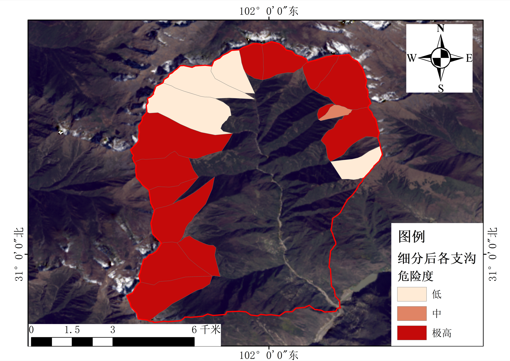
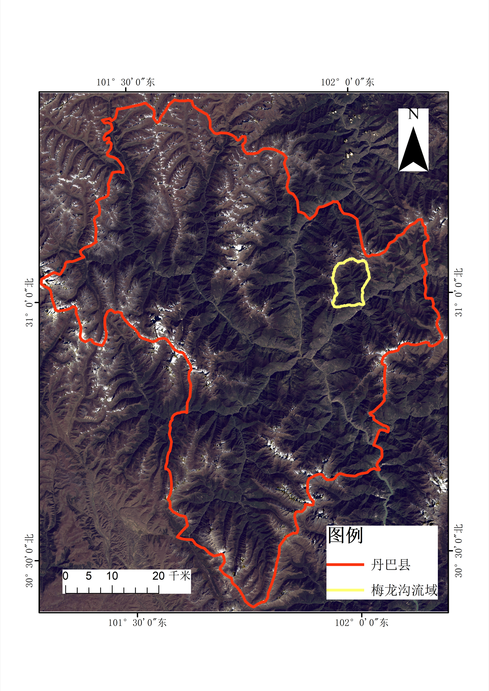
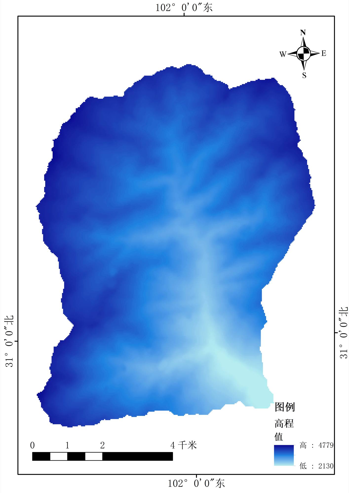
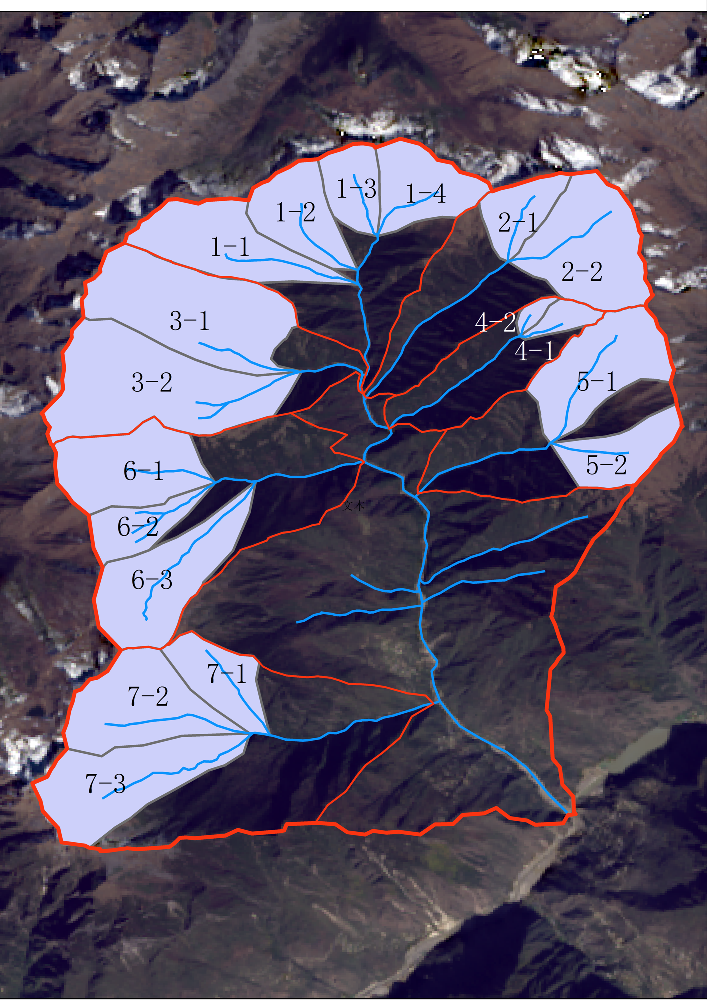

# Debris-Flow Hazard Assessment with ArcGIS

Undergraduate thesis project in Geographic Information Science at Southwest Jiaotong University (2024).

This project assessed relative debris-flow hazard across 18 sub-catchments in the Meilonggou watershed, Danba County, Sichuan, China. The work combined GIS-based terrain and thematic analysis, visual interpretation of remote-sensing imagery, multi-criteria weighting, and cartographic presentation.

## Project overview

The project focused on turning heterogeneous geographic information into a consistent set of evaluation units and indicators. I used ArcGIS to organize spatial data, delineate and subdivide drainage areas, calculate attributes, classify results, and produce the final maps. Landsat 8 imagery and Google Earth Pro were used as supporting references for visual inspection and geographic context.

The analytical workflow evaluated nine indicators:

1. watershed area;
2. mean slope;
3. channel length;
4. longitudinal channel gradient;
5. channel sinuosity;
6. geomorphic information entropy;
7. maximum monthly precipitation;
8. lithologic hardness;
9. proportion of loose surface material.

Indicator values were organized and normalized through ArcGIS Field Calculator and tabular workflows. CRITIC weighting was then combined with an extension-theory assessment to assign each sub-catchment to a relative hazard class.

## GIS workflow

### 1. Locate the study area

The Meilonggou watershed was placed within the wider Danba County context before detailed analysis.

### 2. Prepare terrain and drainage information

Elevation data supported terrain interpretation and the derivation of topographic indicators. Drainage lines and catchment boundaries were checked against Landsat 8 and Google Earth Pro imagery.

### 3. Define comparable assessment units

The watershed was divided into 18 sub-catchments so that terrain, channel, rainfall, lithology, and surface-material indicators could be compared consistently.

### 4. Calculate and map relative hazard

CRITIC-derived indicator weights and extension-theory correlation values were used to assign the final class. The assessment classified 13 sub-catchments as very high hazard, one as medium hazard, and four as low hazard. The highest weights were assigned to lithologic hardness (0.149), mean slope (0.134), and watershed area (0.128).

The detailed classifications and correlation values are available in [`data/hazard-assessment-results.csv`](data/hazard-assessment-results.csv).

## Tools and demonstrated skills

- **ArcGIS:** spatial data preparation, watershed and channel editing, attribute calculation with Field Calculator, thematic classification, and map production
- **Remote sensing:** visual interpretation and cross-checking with Landsat 8 imagery
- **Google Earth Pro:** 3D terrain inspection and geographic verification
- **Multi-criteria assessment:** indicator normalization, CRITIC weighting, extension-theory correlation assessment, and result interpretation
- **Cartography:** study-area, terrain, assessment-unit, and hazard maps

## Interpretation

The final pattern was compared with documented locations affected during the 17 June 2020 Meilonggou debris-flow event. The relevant sub-catchments were classified as very high hazard, providing a consistency check for the spatial result. This was a case-study comparison rather than an independent predictive validation.

## Repository scope and data availability

This repository is a concise public portfolio record of the thesis. It contains selected maps created for the project and a compact result table. It does not contain the full thesis, personal academic records, raw satellite imagery, Google Earth project files, ArcGIS project files, or large third-party terrain, geology, and precipitation datasets.

The map backgrounds and source datasets remain subject to their original providers' terms. Google Earth Pro was used during the academic workflow, but raw Google Earth imagery is not redistributed here. The full Chinese thesis and additional project materials are available from the author on request.

## Thesis information

**Original title:** 基于可拓学的泥石流危险度评价——以丹巴县梅龙沟流域为例  
**English title:** *Risk Assessment of Debris Flow Based on Extension Theory: A Case Study of the Meilonggou Watershed in Danba County*  
**Author:** Yi Zhao  
**Institution:** Southwest Jiaotong University  
**Year:** 2024

