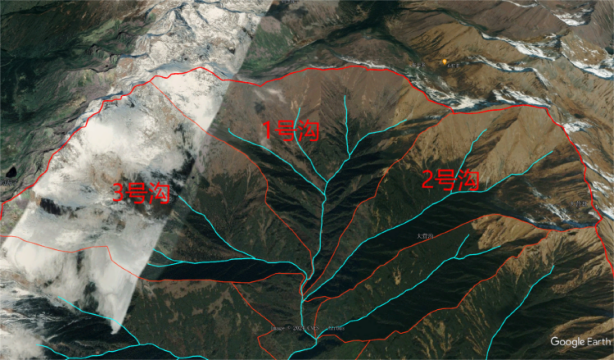

# Debris-Flow Hazard Assessment with ArcGIS

Undergraduate thesis project in Geographic Information Science at Southwest Jiaotong University (2024).

This project assessed relative debris-flow hazard across 18 sub-catchments in the Meilonggou watershed, Danba County, Sichuan, China. The main work was a practical GIS workflow: inspecting the terrain in Google Earth Pro, delineating and transferring catchment units, organizing multi-source data in ArcGIS, calculating nine spatial indicators, and producing a final hazard map.

## What I did

- extracted drainage lines in ArcGIS and checked their positions against Landsat 8 and Google Earth Pro imagery;
- used Google Earth Pro's high-resolution 3D view to inspect ridgelines, valley directions, drainage divides, and the connection between tributaries and the main channel;
- organized the watershed into seven main gullies and manually subdivided them into 18 assessment units;
- saved the interpreted boundaries as KML/KMZ and transferred them back into ArcGIS as polygon feature classes;
- prepared DEM, slope, precipitation, geological, drainage, and interpreted loose-material layers;
- created fields for nine hazard indicators and calculated the values for every sub-catchment with ArcGIS geoprocessing, attribute tables, Field Calculator, and exported worksheets;
- normalized the indicator table, calculated CRITIC weights and extension-theory correlation values, joined the results back to the spatial units, and produced the final thematic map.

## End-to-end geospatial workflow

### 1. Establish the study area

Administrative boundaries, satellite imagery, and watershed data were assembled to locate Meilonggou within Danba County. The study-area map provided the geographic context for all subsequent clipping and analysis.

### 2. Extract and visually check the drainage network

An initial drainage network was extracted in ArcGIS. Landsat 8 imagery provided an optical reference, while Google Earth Pro was used to inspect the watershed in 3D. Viewing the terrain from different angles helped check whether the extracted lines followed the visible valley bottoms and whether the surrounding ridges formed plausible drainage divides.

The ArcGIS drainage and watershed layers were exported with the **Layer To KML** workflow for inspection in Google Earth Pro. The seven main gullies were numbered and their boundaries were refined with reference to terrain relief, channel direction, and tributary connections.

*Google Earth Pro was used as a visual interpretation and verification environment. The image retains the original Google Earth attribution.*

### 3. Delineate 18 sub-catchments and return them to ArcGIS

Each main gully was subdivided to identify more precise assessment units. The interpreted polygons were saved as KMZ, imported with **KML To Layer**, converted to geodatabase feature classes, and checked as a single 18-feature polygon layer. Unit identifiers such as `1-1`, `1-2`, and `3-2` were retained throughout the spatial and tabular analysis.

### 4. Prepare terrain and thematic layers in ArcGIS

The 18 polygons became the common zone layer for the remaining calculations. The ArcGIS workspace contains separate intermediate products for slope statistics, elevation statistics, precipitation statistics, straight-line and channel lengths, geological intersections, and interpreted loose-material intersections.

Key operations included:

- clipping terrain, geological, precipitation, and imagery-derived layers to the study area;
- projecting layers when metric area or length measurements were required;
- running zonal statistics for mean slope, elevation summaries, and precipitation;
- intersecting sub-catchments with geological polygons and loose-material polygons;
- calculating area proportions and area-weighted attributes;
- joining intermediate tables to the 18 sub-catchment polygons;
- adding and calculating the `S1`-`S9` fields in the attribute table;
- symbolizing, labeling, and arranging map layouts with legends, scale bars, north arrows, and coordinate grids.

### 5. Calculate the nine indicators

| Field | Indicator | GIS calculation or source |
| --- | --- | --- |
| `S1` | Watershed area | Polygon area converted to km² |
| `S2` | Mean slope | Mean slope raster value calculated for each sub-catchment with zonal statistics |
| `S3` | Channel length | Length of the interpreted channel line within each assessment unit |
| `S4` | Longitudinal gradient | Relative elevation difference divided by channel length |
| `S5` | Channel sinuosity | Actual channel length divided by straight-line channel length |
| `S6` | Geomorphic information entropy | Derived from zonal minimum, mean, and maximum elevation values |
| `S7` | Maximum monthly precipitation | Maximum value summarized from the clipped monthly precipitation data |
| `S8` | Lithologic hardness coefficient | Area-weighted hardness calculated after intersecting geological units with sub-catchments |
| `S9` | Loose-material proportion | Interpreted low-vegetation/loose-material area divided by sub-catchment area |

The source indicator values are published in [`data/assessment-unit-indicators.csv`](data/assessment-unit-indicators.csv). They show the actual attribute-table structure used before normalization and hazard modelling.

### 6. Normalize and evaluate

The ArcGIS attribute table was exported for model calculation. Indicators positively related to hazard (`S2`, `S3`, `S5`, `S7`, and `S9`) and negatively related to hazard (`S1`, `S4`, `S6`, and `S8`) were normalized separately. CRITIC weighting considered both variation within each indicator and correlation between indicators.

The normalized values and weights were used in an extension-theory model. For every sub-catchment, correlation values were calculated against four classes: very high, high, medium, and low. The class with the maximum correlation value became the mapped result.

The detailed calculation logic and indicator weights are documented in [`docs/METHOD.md`](docs/METHOD.md).

### 7. Join results and produce the final ArcGIS map

The classification table was joined back to the sub-catchment layer. ArcGIS symbology was then used to distinguish the hazard classes and create the final layout. The assessment classified 13 sub-catchments as very high hazard, one as medium hazard, and four as low hazard. The highest indicator weights were lithologic hardness (0.149), mean slope (0.134), and watershed area (0.128).

The final correlation values and classes are available in [`data/hazard-assessment-results.csv`](data/hazard-assessment-results.csv).

## Tools and demonstrated skills

- **Google Earth Pro:** 3D terrain inspection, manual catchment interpretation, gully subdivision, KML/KMZ editing, and geographic verification
- **ArcGIS / ArcGIS Pro:** KML conversion, geodatabase management, coordinate handling, clipping, intersection, zonal statistics, table joins, Field Calculator, attribute management, thematic symbology, and map layouts
- **Remote sensing:** comparison with Landsat 8 imagery and manual interpretation of low-vegetation areas as a proxy for loose surface material
- **Tabular analysis:** indicator normalization, CRITIC weighting, extension-theory correlation calculations, and result checking
- **Cartography:** production of location, elevation, assessment-unit, factor, and hazard maps

## Interpretation

The final pattern was compared with documented locations affected during the 17 June 2020 Meilonggou debris-flow event. The relevant sub-catchments were classified as very high hazard, providing a consistency check for the spatial result. This was a case-study comparison rather than an independent predictive validation.

## Repository scope and data availability

This repository is a public portfolio record of the thesis. It contains selected maps and derived indicator and result tables. It does not contain the full thesis, personal academic records, raw satellite imagery, Google Earth project files, ArcGIS project/geodatabase files, or large third-party terrain, geology, and precipitation datasets.

The map backgrounds and source datasets remain subject to their original providers' terms. Google Earth Pro was used during the academic workflow, but editable Google Earth source data and raw imagery are not redistributed here. The full Chinese thesis and additional project materials are available from the author on request.

## Thesis information

**Original title:** 基于可拓学的泥石流危险度评价——以丹巴县梅龙沟流域为例  
**English title:** *Risk Assessment of Debris Flow Based on Extension Theory: A Case Study of the Meilonggou Watershed in Danba County*  
**Author:** Yi Zhao  
**Institution:** Southwest Jiaotong University  
**Year:** 2024
